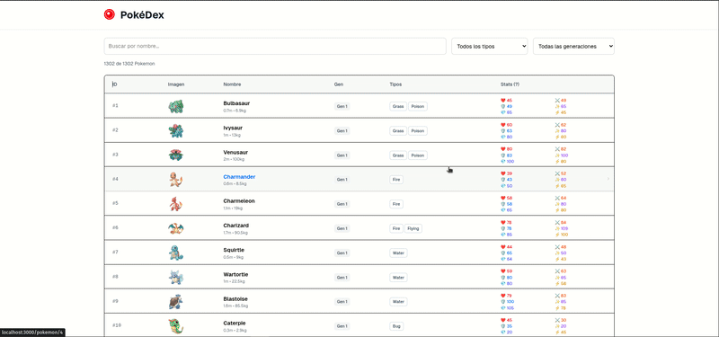

# PokéDex - Modern T3 Stack Implementation

A modern PokéDex application built with Next.js 15, TypeScript, and T3 Stack featuring advanced search, filtering, virtual scrolling, and smooth page transitions. Includes an automated scraper that fetches Pokemon data from PokeAPI and stores it in PostgreSQL for optimal performance.

**Note**: Mega Evolutions are excluded from evolution data as they represent temporary battle transformations rather than permanent evolutionary changes. They are also not included in PokeAPI evolutions endpoint. Only permanent evolutions are tracked. Mega Evolutions, being temporary battle forms, are outside the current data model scope.

## **Key Features**

- **Virtual Scrolling** - Handles 1000+ Pokemon efficiently with animations
- **Instant Search** - Real-time filtering across names and evolution chains  
- **Smooth Transitions** - Page transitions with shared element animations
- **Advanced Filtering** - Type, generation, and evolution chain filters
- **Performance Optimized** - Local PostgreSQL + HTTP caching (24h)
- **State Persistence** - Maintains filters and scroll position



## **Quick Start**

### Deployment 

```bash
# Clone the repository
git clone <repository-url>
cd pokedex

# Setup environment
cp .env.example .env

# Note: these environment variables are production-ready, they are documented and explained in the .env file  itself

# Start with Docker
docker-compose up --build
```

**Access the app**: http://localhost:3000

### Development

For development, modify the `DATABASE_URL` env var to point to localhost and run the `start-database.sh` to create a local database instance with Docker. The run `pnpm dev`.

## **Architecture**

### System Overview

This project uses two containers:
- Postgres Database
- Next.js app (Reads from DB) + PokeAPI Scraper (Writes to DB)

```
┌─────────────────┐    ┌──────────────────┐    ┌─────────────────┐
│   Frontend      │    │   Next.js API    │    │   PostgreSQL    │
│   (React/TSX)   │◄──►│   (tRPC/Prisma)  │◄──►│   (Pokemon DB)  │
└─────────────────┘    └──────────────────┘    └─────────────────┘
                                                        ▲
                                                        │
                                               ┌──────────────────┐
                                               │   PokeAPI        │
                                               │   Scraper        │
                                               └──────────────────┘
```

### Why Use a Scraper?

**Performance Benefits:**
- **Speed**: Single DB query vs multiple API calls
- **Complex Relationships**: The evolution search feature requires complex data relationships that are expensive to compute in real-time
- **Advanced Filtering**: Multi-dimensional queries
- **Reliability**: Reduced external API dependency
- **Separation of concerns**

**Data Optimizations:**
- Removed unnecessary timestamp fields
- Compressed stats arrays (number[] vs objects)
- Extracted common image URL paths
- Pre-computed evolution relationships

## 🛠️ **Tech Stack**

### Core (T3 Stack)
- **Next.js 15** - App Router, Server Components, Image Optimization
- **TypeScript** - Full type safety across frontend/backend
- **tRPC** - End-to-end typesafe APIs
- **Prisma** - Database ORM with migrations
- **TailwindCSS** - Utility-first styling

### Additional Libraries
- **Zod** - Runtime validation and type inference
- **next-view-transitions** - Smooth page animations
- **p-limit & p-retry** - Scraper concurrency control

### Infrastructure
- **PostgreSQL** - Primary database
- **Docker** - Containerized deployment
- **pnpm** - Fast package management

## **Tests**

Vitest + RTL 

Run locally with `pnpm test`

Check types with `pnpm typecheck`

## **Acknowledgments**

- [PokéAPI](https://pokeapi.co/)
- [T3 Stack](https://create.t3.gg/) 
